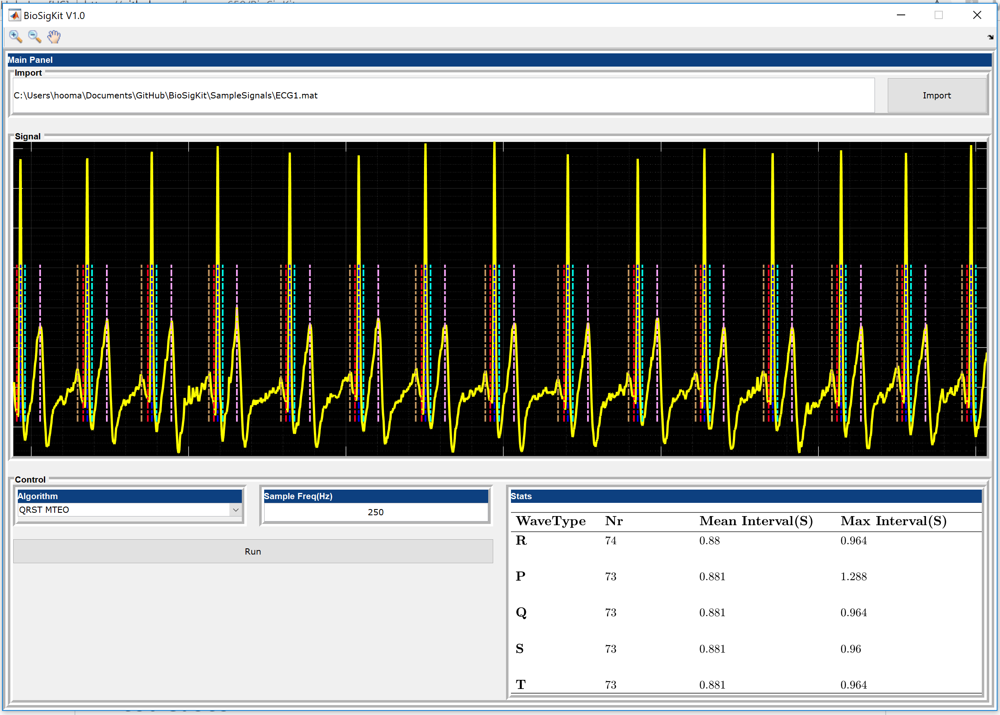

# BioSigKit
BioSigKit is a set of useful signal processing tools in Matlab that are either developed by me personally or others in different fields of biosignal processing. BioSigKit is a wrapper with a simple visual interface that gathers this tools under a simple easy to use platform. 

# QRS Detection Algorithms offered by BioSigKit
BioSigKit provides a set of subroutines implementing the six following QRS detection algorithms:

Pan and Tompkins [[J. Pan](http://www.robots.ox.ac.uk/~gari/teaching/cdt/A3/readings/ECG/Pan+Tompkins.pdf);[H. Sedghamiz, 2014](https://www.mathworks.com/matlabcentral/fileexchange/45840-complete-pan-tompkins-implementation-ecg-qrs-detector)]: This algorithm is probably one of the most widely used algorithms for QRS detection in the research community. It combines a set of preprocessing methods in order to enhance the detection rate and reduce the false detection of T-waves in the ECG recordings (subroutine name : ```BioSigKit.PanTompkins()```).

Nonlinear Phase Space Reconstruction [@Lee2002]: This method employs the area under the non-linear phase space reconstruction of the ECG recording in order to identify the QRS complexes (subroutine name : ```BioSigKit.PhaseSpaceAlg()```).

State-Machine [@sedghamiz2013online]: This algorithm employs state-machine in order to identify R, S and T waves in an ECG recording (subroutine name : ```BioSigKit.StateMachine()```).

Filter Bank [@Afonso1999]: The filter bank method combines several band-pass filters in order to better delineate the QRS complexes. This algorithm is very similar to wavelet based QRS detectors (subroutine name : ```BioSigKit.FilterBankQRS()```).

QRS Multilevel Teager Energy Operator (MTEO) [@7391510]: This algorithm employs Multilevel Teager Energy Operator (MTEO) in order to locate the QRS complexes. MTEO has been successfully used in Electromyography signals for action potential detection [@7391510] since it is computationally much more efficient than wavelet transform (subroutine name : ```BioSigKit.MTEO_qrstAlg()```).

Automatic Multiscale-based Peak Detection [@Scholkmann2012]: This method is a more general peak detection. However, according to the study by Scholkmann et al. [@Scholkmann2012], it showed a high performance for the beat detection as well. Therefore, it is implemented as one of the subroutines in BioSigKit (subroutine name : ```BioSigKit.AMPD_PAlg()```).

# Getting Started
BioSigKit might be used either from the command line or its Graphical User Interface (GUI).
## Command Line : 

To use the command line simply call the constructor as follows:
```analysis = BioSigKit(InputSig, SampleFreq, 0);```

To access subroutines simply use the point operator as :
```analysis.PanTompkins();```

The results are stored in the result struct, you can access it as :
```analysis.Results;```

To see the list of all the subroutines and children accessible simply call ```analysis``` in Matlab command-line.

## GUI : 
To instantiate the GUI, simply run the ```RunBioSigKit()```.

## Examples :
See the ```Demo.m``` for a few examples on how to use BioKitSig.

## GUI Functionalities



